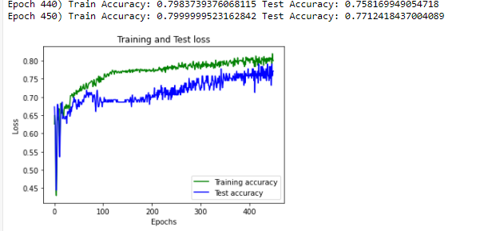

# Basically, at 650 it shows an accuracy of 0.79.  
Another photos were attached with test results.

650th eppch: 
   

<br\>

450th epoch (good results):
 

500th eppch (still good results): 
 

2000th epoch: 

